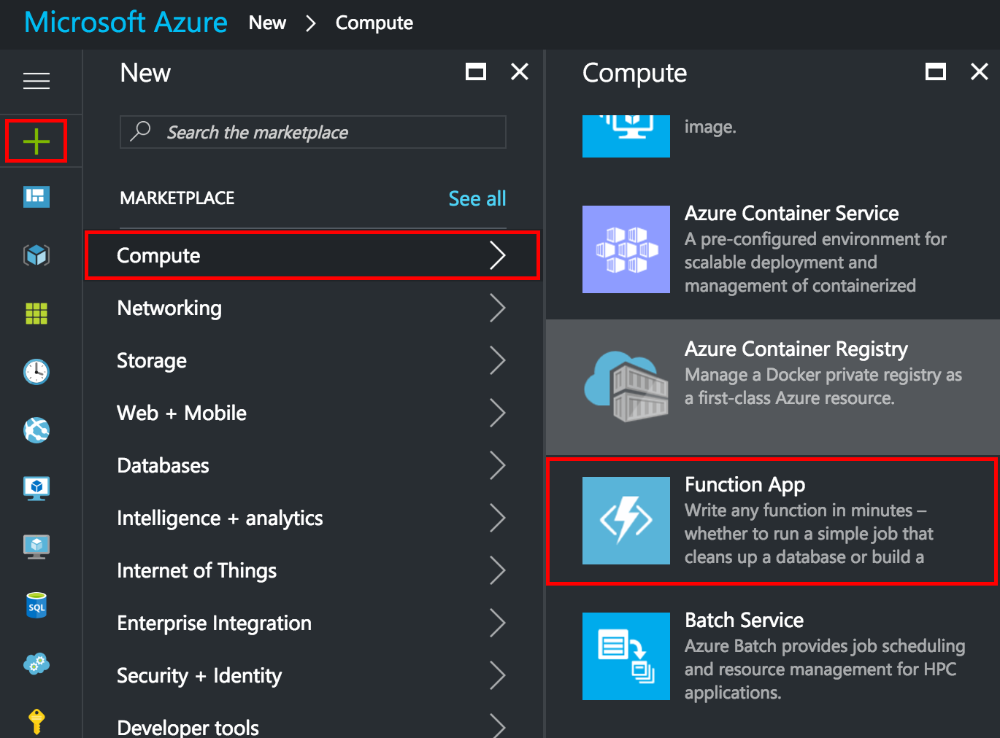
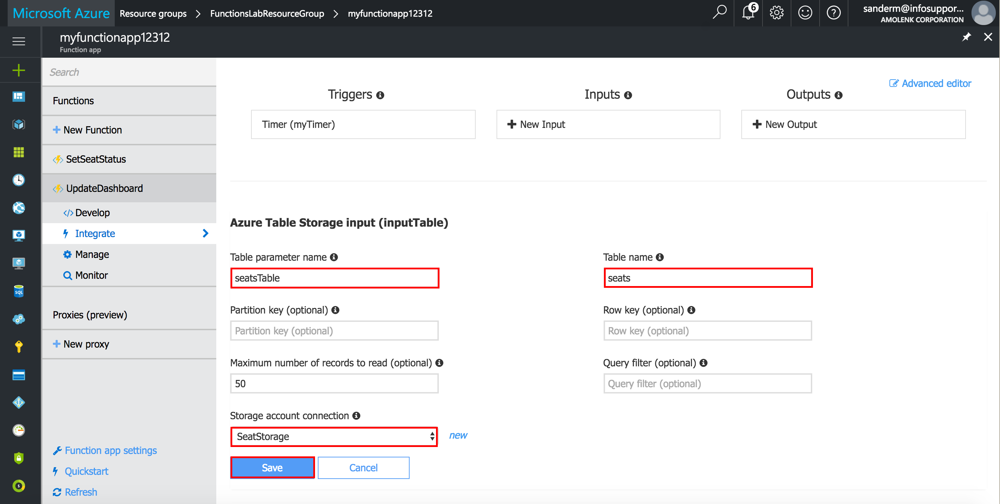

# Dutch Azure Meetup 5 - HOL
## Prerequisites
The following are required to complete this hands-on lab:

- An active Microsoft Azure subscription. If you don't have one, [sign up for a free trial](http://aka.ms/WATK-FreeTrial).
- [Microsoft Azure Storage Explorer](http://storageexplorer.com) (optional)

## Exercises
This hands-on lab includes the following exercises:

- Exercise 1: Create an Azure Function App
- Exercise 2: Add the SetSeatStatus Azure Function
- Exercise 3: Register the room and start receiving events
- Exercise 4: Add the UpdateDashboard Azure Function

## Exercise 1: Create an Azure Function App
The first step in writing an Azure Function is to create an Azure Function App. In this exercise, you will create an Azure Function App using the Azure Portal.

1. Open the [Azure Portal](https://portal.azure.com) in your browser. If asked to log in, do so using your Microsoft account.

2. Click **+ New**, followed by **Compute** and **Function App**.

	
	
3. Enter an app name that is unique within Azure. Under **Resource Group**, select **Create new** and enter "FunctionsLabResourceGroup" (without quotation marks) as the resource-group name to create a resource group for the Function App. Choose the **Location** nearest you, and accept the default values for all other parameters. Then click **Create** to create a new Function App.

    
	
4. When the deployment has completed, navigate to the deployed “FunctionsLabResourceGroup” resource group. Then click the storage account that was created for the Function App.

	
	
5. Click **Access keys** to view the access keys required to authenticate your functions when making requests to this Azure storage account. Make a copy of the first connection string as we will need this later on.

	
	
6. Return to the blade for the "FunctionsLabResourceGroup" resource group and click the Azure Function App.

7. Click **Function app settings** and then click on **Configure app settings**.
	
    
	
8. In the **App settings** section, add a new **SeatStorage** setting using the copied storage account connection string as the value. Click **Save** We are now able to access the storage account from the functions we’ll write to store seat availability data.

	

The Azure Function App has been created and you have added an app setting for a storage account. You can reference the storage account from any functions using the app setting key.

## Exercise 2: Add the SetSeatStatus Azure Function
Once you have created an Azure Function App, you can add Azure Functions to it. In this exercise, you will add a function to the Function App you created in Exercise 1 and write C# code that receives seat availability events from a Azure Storage Queue and updates corresponding state in an Azure Storage Table.

1. Return to the blade for the “FunctionsLabResourceGroup” resource group and click the Azure Function App that you created in Exercise 1.
2. Click **+ New Function** and set **Language** to **C#**. Then click **QueueTrigger-CSharp**.
	
    
	
3. Enter “SetSeatStatus” (without quotation marks) for the function name and “seat-events” into the **Path** box. Select “SeatStorage” from the **Storage account connection** dropdown list. Then click the **Create** button to create the Azure Function.
	
	
4. Click **Integrate** and then enter “seatEventText” in the **Message parameter name** box. This parameter will contain the body of the received queue messages. Click **Save**.

    

5. We need an additional output binding to an **Azure Storage Table** to save the current seat availability status. Click **+ New Output**. Select **Azure Table Storage**, then click **Select**.

6. Enter “seatsTable” into the **Table parameter name** box and “seats” into the **Table name** box. Select “SeatStorage” from the **Storage account connection** dropdown list. Then click the **Save** button to save the output settings.

    
 
7. Click **Develop** to return to the code editor. Replace the code shown in the code editor with the following statements:

    ```
    // You can add NuGet packages to the function by adding dependencies
    // in the project.json file. Some often-used assemblies are special
    // cased however, and may be referenced by simplename syntax:
    #r "Microsoft.WindowsAzure.Storage" 
    #r "Newtonsoft.Json"

    using System;
    using Microsoft.WindowsAzure.Storage.Table;
    using Newtonsoft.Json;

    // This is the main method of the function.
    // seatEventText is bound to the storage queue trigger and will contain the message body.
    // seatsTable is bound to the output storage table.
    public static void Run(string seatEventText, CloudTable seatsTable, TraceWriter log)
    {
        // Deserialize the message body into an actual object.
        var seatEvent = JsonConvert.DeserializeObject<SeatEvent>(seatEventText);

        log.Info($"Status of seat {seatEvent.SeatNumber} in room {seatEvent.RoomId} changed (IsTaken = {seatEvent.IsTaken}).");

	// To store data in a storage table, we need to create a table entity.
	// Entities provide a PartitionKey to determine in what table partition to save the entity
	// as well as a RowKey to make the entity unique within the partition.
        SeatEntity entity = new SeatEntity
        {
            PartitionKey = seatEvent.RoomId.ToString(),
            RowKey = seatEvent.SeatNumber.ToString(),
            IsTaken = seatEvent.IsTaken
        };

	// We use InsertOrReplace here because the table will be empty initially, but
	// there will be multiple events coming in for the same seat.
        TableOperation operation = TableOperation.InsertOrReplace(entity);
        seatsTable.Execute(operation);
    }

    public class SeatEvent
    {
        public Guid RoomId { get; set; }
        public int SeatNumber { get; set; }
        public bool IsTaken { get; set; }
    }

    public class SeatEntity : TableEntity
    {
        public bool IsTaken { get; set; }
    }
    ```

    Click **Save**.

    

8. You can test the function by clicking **Test** and then entering the following sample data into the **Request body** box.

    ```
    {
    "RoomId": "f7fe2e9c-1140-4f28-8002-7c19aea5e3c4",
    "SeatNumber": 3,
    "IsTaken": true
    }
    ```

    Click **Run**. 

    

    You should see a *202 Accepted* status and a log message showing that the status of seat 3 has changed to *true*.

9. Click **Run** to start the function.

    

You’ve created a function that receives seat availability events on a storage queue and persists the seat states in a storage table.

## Exercise 3: Registering the room and receiving events
In this exercise you’ll register your personal room in a Room Dashboard. Once registered, you’ll automatically start receiving seat availability events in your storage queue. Then you will use the cross-platform Microsoft Azure Storage Explorer to view the stored seat availability data in the storage table.

1. Open a browser window and navigate to [bit.ly/2o8cGGe](http://bit.ly/2o8cGGe).

    
	
2. Click **Register**. Enter a name for your room into the **Room name** box and the copied Azure Storage connection string from Exercise 1 into the **Storage Queue Connection String** box.  Then click the **Register** button.

    

3. Find the room you added in the room list and copy the room id (guid). You’ll need this in the next function you’ll write to update the dashboard. Also note that the room has been assigned a capacity of 100 seats.

    

4. If you haven’t installed the Microsoft Azure Storage Explorer, go to http://storageexplorer.com and install it now. Versions are available for Windows, macOS, and Linux.

    Start Storage Explorer. If you are asked to log in, do so using the same account you used to log in to the Azure Portal.

    Find the storage account that was created for your Azure Function App in Exercise 1 and expand the list of tables underneath it. Then click the table named “seats”.

    > If this is the first time you have run Storage Explorer, you may have to click the person icon and tell it which Azure subscription or subscriptions you want it to display.  

    

    As you can see the table contains the seat availability data that your function receives from the storage queue. In the next exercise, we’ll periodically use this data to update the dashboard.

    

## Exercise 4: Add the UpdateDashboard Azure Function
In this exercise, you will add a second function to the Function App you created in Exercise 1 and write C# code that updates the Room Dashboard using the seat availability data stored in the Azure Storage Table.

1. Return to the blade for the “FunctionsLabResourceGroup” resource group and click the Azure Function App that you created in Exercise 1.

2. Click **+ New Function** and set **Language** to **C#**. Then click **TimerTrigger-CSharp**.

3. Enter “UpdateDashboard” (without quotation marks) for the function name and “*/10 * * * * *” into the **Schedule** box. Then click the **Create** button to create the Azure Function.

	
	
4. We need an additional input binding to an **Azure Storage Table** to get access to the stored seat availability data. Click **Integrate** and then click **+ New Input**. Select **Azure Table Storage**, then click **Select**.

5. Enter “seatsTable” into the **Table parameter name** box and “seats” into the **Table name** box. Select “SeatStorage” from the **Storage account connection** dropdown list. Then click the **Save** button to save the input settings.

	
	
6. Click **Develop** to return to the code editor. Replace the code shown in the code editor with the following statements:

    ```
    #r "Microsoft.WindowsAzure.Storage" 

    using System;
    using System.Text;
    using System.Net.Http;
    using Microsoft.WindowsAzure.Storage.Table;

    public static async Task Run(TimerInfo myTimer, IQueryable<Seat> seatsTable, TraceWriter log)
    {
        Dictionary<string, int> roomConfigs = new Dictionary<string, int>
        {
            { "<ROOM-ID>", 100 }
        };

        HttpClient client = new HttpClient();
        client.BaseAddress = new Uri("http://webui20170327091447.azurewebsites.net/api/");
        
        foreach (var roomConfig in roomConfigs)
        {
            var takenSeatCount = seatsTable
                .Where(s => s.PartitionKey == roomConfig.Key)
                .ToList() // Executes table query.
                .Count(s => s.IsTaken);

            var availableSeatCount = roomConfig.Value - takenSeatCount;

            log.Info($"Reporting {availableSeatCount} available seat(s) for room {roomConfig.Key}.");

            await client.PutAsync(
                $"room/{roomConfig.Key}",
                new StringContent(availableSeatCount.ToString(), Encoding.ASCII, "application/json"));
        }
    }

    public class Seat : TableEntity
    {
        public bool IsTaken { get; set; }
    }
    ```

7. Replace the **<ROOM-ID>** placeholder with your personal room id (guid) from the Room Dashboard. Click **Save**.

    

You’ve created a function that updates the Room Dashboard every 10 seconds with the seating availability of your room. Have a look at [bit.ly/2o8cGGe](http://bit.ly/2o8cGGe)!


